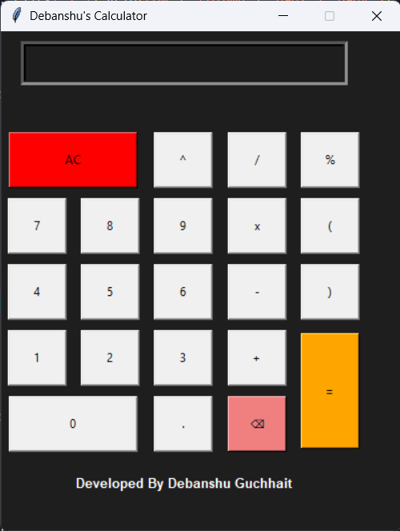
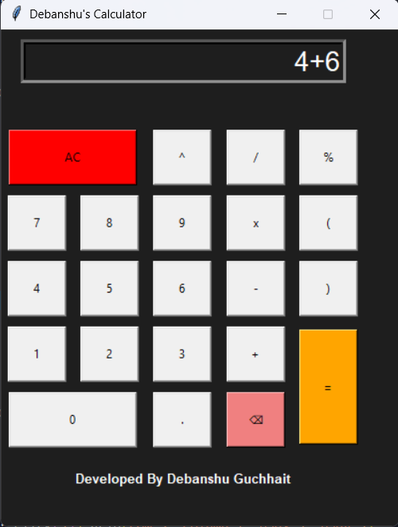
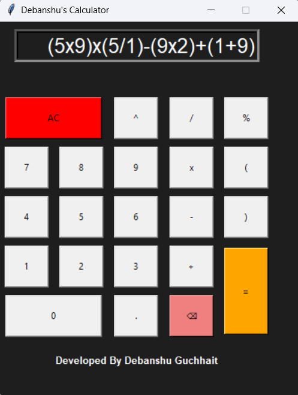
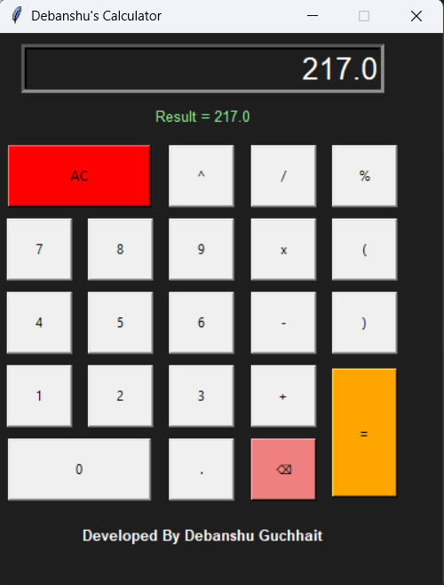

# 🧮 Debanshu's Calculator

A modern GUI Calculator built using Python and Tkinter.

## ✨ Features

- Basic arithmetic operations
- Power operator (^)
- All clear button
- Backspace button
- Clean dark UI
- Real-time result display
- Error handling

## 📸 Screenshot


<p align="center">
  
</p>

<p align="center">
  
  
</p>

<p align="center">
  
  
</p>

<p align="center">
  
  
</p>

## 🚀 Technologies Used

- Python
- Tkinter

## ▶️ Run the Project

## Option 1: Run via Python Source Code

To run the calculator using the Python script, make sure Python is installed on your system.

### 1️⃣ Download the Project

Download this repository as a ZIP file from GitHub and extract it.

Or clone the repository using Git:

```bash
git clone https://github.com/YOUR_USERNAME/calculator-project.git
```

---

### 2️⃣ Open the Project Folder

Open Terminal or Command Prompt and navigate to the project folder:

```bash
cd calculator-project
```

---

### 3️⃣ Run the Calculator

Execute the following command:

```bash
python calculator.py
```

If `python` does not work, try:

```bash
python3 calculator.py
```

---

## 🖥️ Output

The Calculator GUI window will open automatically.

---


# 🛠️ Technologies Used

- Python
- Tkinter
- PyInstaller

```
