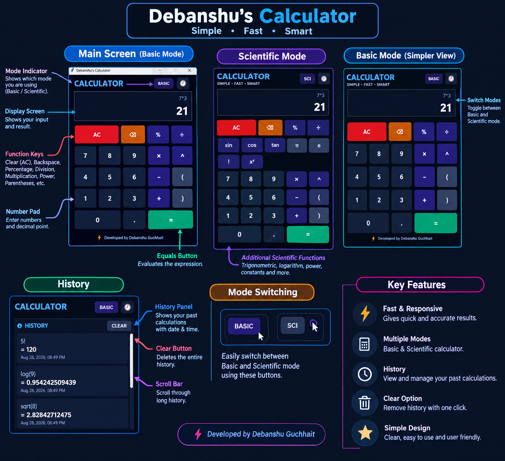

# 🧮 Debanshu's Scientific Calculator

A modern and responsive **Scientific Calculator Web App** built using **HTML, CSS, and JavaScript**.

## 📸 Screenshot



## ✨ Features

* 🧮 Basic arithmetic operations
* 🔬 Scientific calculations
* 📐 DEG / RAD mode
* √ Square root, x², xʸ
* sin, cos, tan
* log and ln
* Factorial `!`
* π and e constants
* 🕘 Calculation history
* 💾 History saved using Local Storage
* ⌨️ Keyboard support
* 📱 Responsive design

## 🛠️ Technologies

* HTML5
* CSS3
* JavaScript
* Local Storage

## 📂 Project Structure

```text
debanshu-calculator/
├── index.html
├── style.css
├── script.js
├── screenshot.png
└── README.md
```

## 🚀 Run

Download or clone the repository and open **`index.html`** in your browser.

No installation required.

## 🌐 Live Demo

**GitHub Pages:**
`https://debanshu-guchhait.github.io/debanshu-calculator/`

## 👨‍💻 DEVELOPER

**Debanshu Guchhait**

⭐ If you like the project, consider giving it a star!
